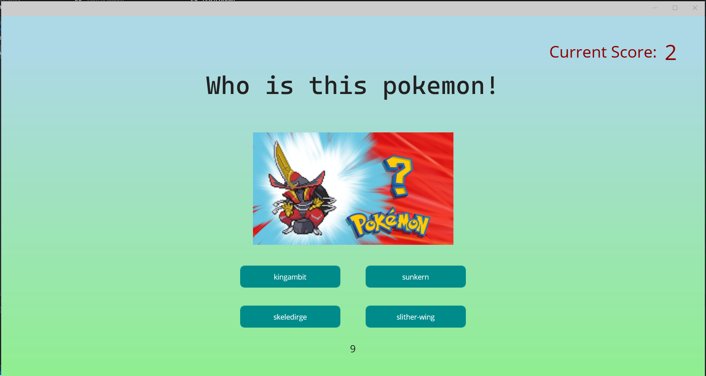
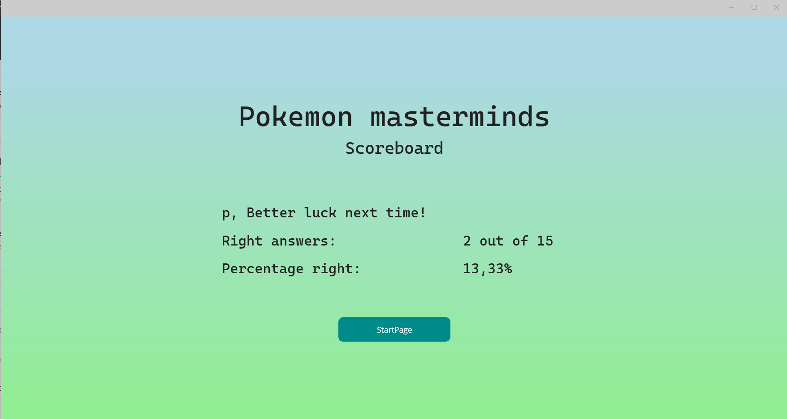

# Pokémon Mastermind

In Pokémon Masterminds kun jij je Pokémon kennis op de proef stellen, start het spel en beantwoord een reeks van 15 vragen in steeds oplopend tempo! Weet jij alle vragen goed te beantwoorden binnen de tijd? Deze readme legt volledig de werking van het spel uit zodat jij binnenkort een echte Pokémon Mastermind bent!

## Start Scherm

wanneer je het spel opstart zal je komen op een scherm met een knop met de tekst "Play Game", Druk hierop om verder te gaan.

## Join lobby Scherm

Nadat je op het Start Scherm op "Play Game" hebt gedrukt kom je op een pagina waar je je naam kan kiezen, vul hier een naam in.
Wanneer er geen naam wordt ingevuld kom je de tekst "Please fill in a name!" te zien en kan je niet beginnen met spelen. Wanneer je een naam hebt ingevuld druk je op de knop "Join lobby" om verder te gaan.

## Game voorbereidings scherm

Nadat je op "Join lobby" heb gedrukt kom je op een scherm waarop er een gifje te zien is, ook is de knop met de tekst "Questions are loading..." erop te zien. Wanneer je dit ziet zijn worden de vragen opgehaald vanuit de API, zodra dit klaar is en vragen gereed staan zal de gif verdwijnen en krijgt de knop de tekst "Start Game!", druk hierop om te beginnen met het spel.

Mocht je je naam willen wijzigen nadat je op dit scherm bent gekomen, dan kan je weer pijltje terug doen.

## Het spel spelen

Zodra het spel is gestart krijg je een afbeelding van een Pokémon te zien + 4 knoppen met daarin elk een mogelijk antwoord, het is aan jou de taak om te raden welke Pokémon er getoond wordt, weet je het? dan druk je op de knop met het juiste antwoord.

Onderaan het scherm vindt je een timer, deze telt af en laat zien hoeveel seconden je nog over hebt om de vraag te beantwoorden.

rechts bovenin het scherm zie je de huidige score en daarmee hoeveel antwoorden je tot nu toe goed hebt.

elke 5 vragen krijg je 5 seconden minder de tijd om te antwoorden, in totaal zijn er 15 vragen en begint de tijd met 15 seconden, de laatste 5 vragen heb je dus slechts 5 seconden de tijd om te antwoorden!

Na het beantwoorden van de vraag krijg je nog kort te zien welk antwoord het juiste antwoord was doormiddel het groen worden van de knop met het juiste antwoord, heb je fout geantwoord wordt jouw gekozen antwoord rood, of heb je helemaal niet geantwoord dan krijg je de tekst "No answer selected! Times up!" te zien en wordt het juiste antwoord ook in het groen weergegeven. tevens krijg je een tekst te zien waarin staat of je juist of onjuist hebt geantwoord, indien je wel een antwoord gegeven hebt.

## ScoreBoard
Zodra de 15 vragen zijn afgelopen kom je op het scoreboard scherm terecht. Op dit scherm kun je jouw score terug vinden, hoeveel vragen van de 15 jij juist hebt beantwoord, en de percentage juiste antwoorden.

Door op weer op "StartPage" te drukken kom je weer terug op het Game voorbereidings scherm. Mocht je je score toch nog eens willen bekijken voordat je een nieuw spel start? dan kan je op dit scherm weer pijltje terug doen.

## handige tips voor de beste spel ervaring

- vergroot het scherm tot volledige grote (fullscreen)

- Zet je geluid aan voor alle ingame sounds!

  

## Info over ontwikkeling
Het oorspronkelijke idee was om er een multiplayer game van te maken waarbij meerdere spelers aan dezelfde quiz meenamen en vervolgens gezamenlijk op het scoreboard werden neergezet. Echter is het uiteindelijk een single player spel geworden, het spel is hier dus ook volledig werkend opgemaakt.

De applicatie maakt gebruik van de PokeAPI om alle Pokémon data op te halen, dit betreft de namen en de afbeeldingen welke nodig zijn voor de vragen.

- Er is gebruik gemaakt van .Net Maui om de applicatie te ontwikkelen
- C#11.0 is gebruikt
- .Net versie 7.0.302 is gebruikt